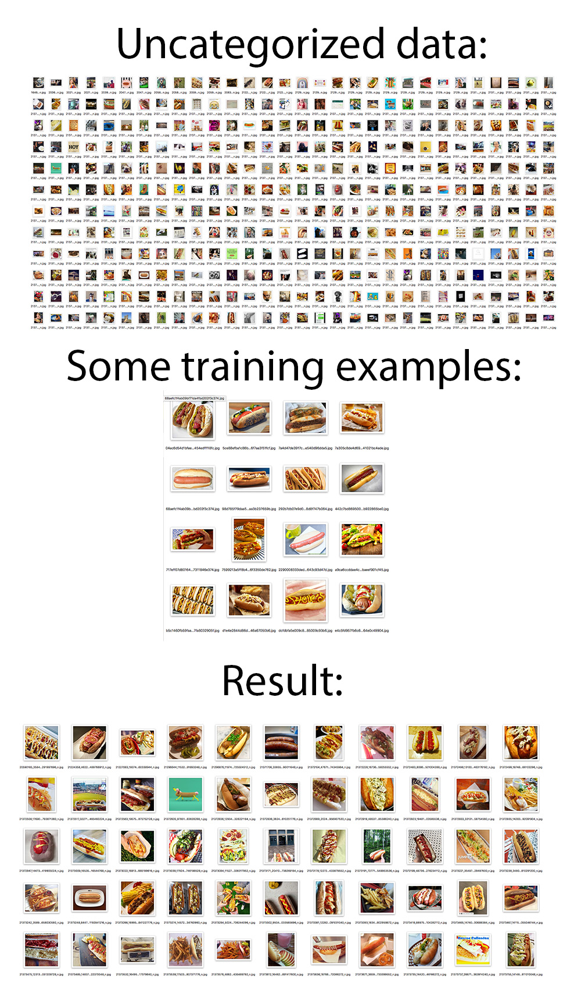

# Smart Categorizer
This is the trainable tool that can be used to automate the categorization process of images. It expects that you provide some categorized examples (it works pretty good given just 10 examples) on which it will be trained on and then it categorize data automatically. 



### Prerequisites
- Python 2.7
- [TensorFlow](https://github.com/tensorflow/tensorflow) >= 1.2
- [Keras](https://github.com/fchollet/keras) >= 2.0.7

## Install
1. Install tensorflow (GPU or CPU)
2. Instal requirements: `pip install -r requirements.txt`

## Usage example

```python categorize.py --positives=/datasetsA/positives/ --target_data=/dir/containing/images --save_to=/datasets/autoA```

Args:

`--positives` - directory containing positive images to train on

`--negatives` - (optional) directory containing negative images to train on

`--target_data` - path to directory containing uncategorized data

`--save_to` - path to save automatically categorized data

Negatives argument is optional because this code uses some predefined negative pool of images (stored in data folder), but if you provide negative examples the result will probably be more accurate.
